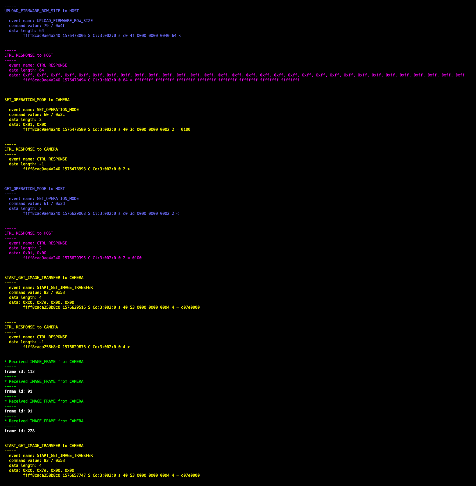

Tool for parsing usbmon traces of traffic to/from Seek Thermal USB cameras. Tested with Mosaic and Micro cores, should also work for their mobile-compatible line of devices.

This is useful for writing drivers to communicate directly with the cameras without involving the closed-source SDKs/drivers provided by Seek Thermal.

Given a (text) file containing usbmon traffic traces, it will attempt to decode the command names and data payloads involved with the transaction.

Example output from the tool:

